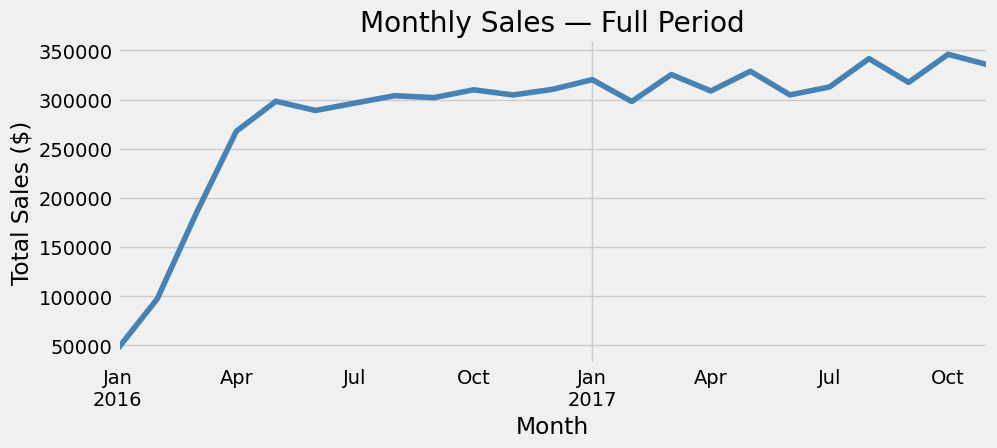
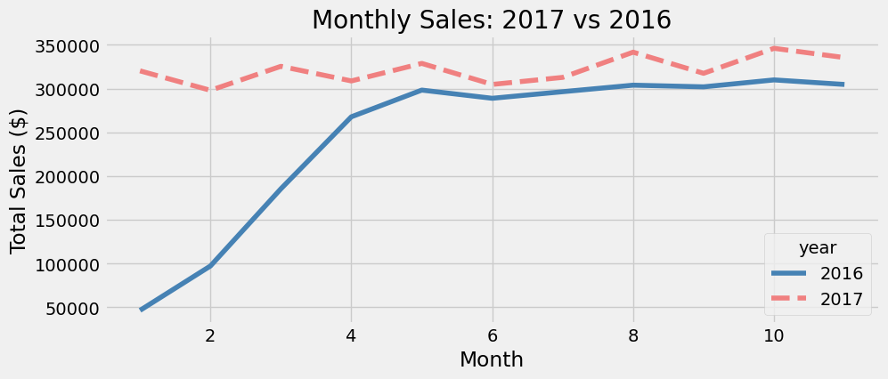
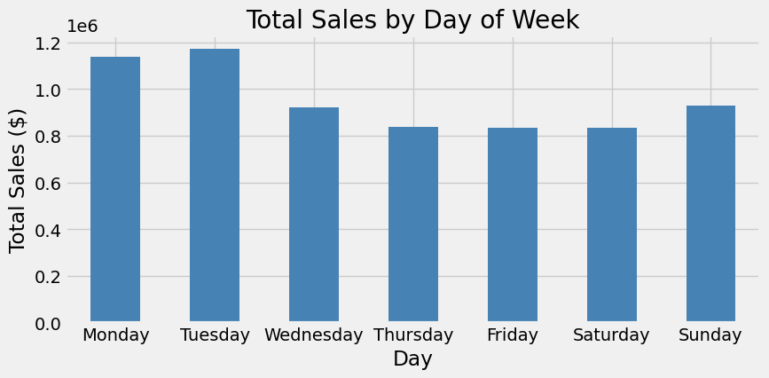
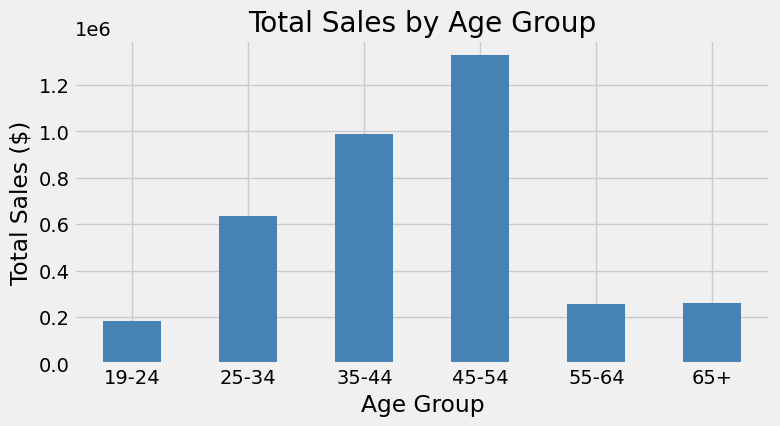
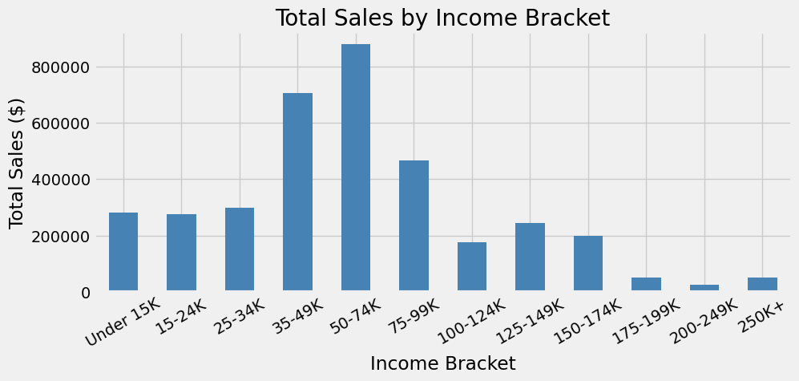
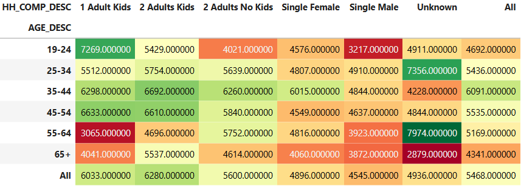

# MegaMart Retail Sales Analysis

## Overview
This project analyzes two years of retail transaction data from Maven MegaMart, a multinational grocery and retail chain evaluating a potential acquisition target.
The analysis combines transaction, demographic, and product data to examine sales trends, customer spending patterns, and department performance.

## Business Questions
- How have total sales trended over time, and is the business growing?
- Which days of the week drive the most revenue?
- Which customer age groups and income brackets spend the most?
- What household compositions show the highest average spend?
- Which product departments perform best across different age groups?

## Tools & Libraries
- Python 3 | Pandas | Matplotlib

## Dataset
The dataset is not included in this repo due to file size.
You can download it from the links below and place the files inside a `/data` folder before running the notebook:

- [Transactions](https://drive.google.com/file/d/1GYuxOUd7bGAjQodQXQ1Q_QtXbdSSeebg/view?usp=drive_link)
- [Demographics](https://drive.google.com/file/d/1Qd_YeQsaHCm9TVTrtbdRR6eaFXuOeEXp/view?usp=drive_link)
- [Products](https://drive.google.com/file/d/1g1ciE2LZiKbwV81_tsTeLf-4SXOU4kxE/view?usp=drive_link)

## Key Findings
This analysis looked at two years of sales data across about 2,100 households and multiple product departments. Here are the main takeaways.

**1. Sales are stable with a small increase**
Monthly sales don’t change much over time, but 2017 is slightly higher than 2016.

**2. Weekdays and weekends look similar**
Sales are distributed evenly across the week. Sunday is a bit higher, but not by a large margin.

**3. Families aged 35–54 have the highest average spend**
Households with children in the 35–44 and 45–54 age groups record the highest average spend per household.

**4. Grocery is the main driver of sales**
Most spending comes from grocery and everyday essentials across all customer groups.

## Visualizations

### Monthly Sales Trend

### Year-over-Year Comparison (2016 vs 2017)

### Sales by Day of Week

### Total Sales by Age Group

### Total Sales by Income Bracket

### Average Household Spend by Age & Household Composition

---

## Skills Demonstrated

- Memory optimization using selective column loading and dtype management
- Data cleaning and quality checks
- Multi-table joins and relationship validation
- Time-series analysis and year-over-year comparisons
- Customer segmentation by age, income, and household composition
- Pivot tables and heatmaps for multidimensional analysis
- Business-focused interpretation of analytical results

---

## contact 
**Amirabas Ziaee**
- Linkedin: https://www.linkedin.com/in/amirabasziaee
- Email: aaziaee04@gmail.com
